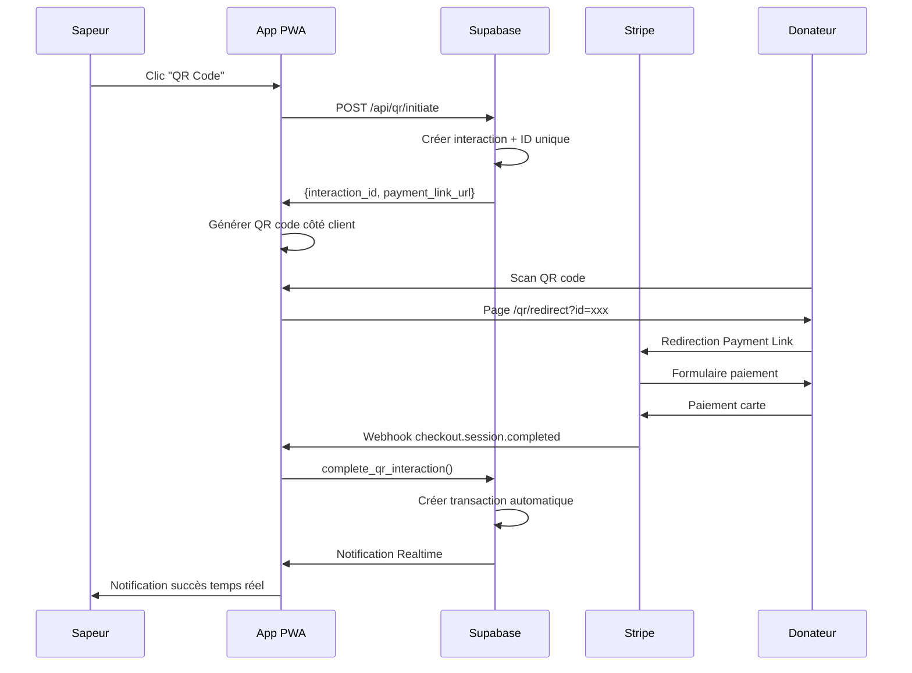

# 🚀 Guide d'Installation - Système QR Code

## ✅ Récapitulatif de l'Implémentation

Le système de paiement QR Code a été **entièrement implémenté** avec :

### 📁 **Fichiers Créés/Modifiés**

```
📦 calendriers-sp/
├── 🆕 migrations/001_add_qr_code_system.sql
├── 🆕 src/app/api/stripe-webhook/route.ts  
├── 🆕 src/app/api/qr/initiate/route.ts
├── 🆕 src/app/qr/redirect/page.tsx
├── 🆕 src/components/QRCodeDisplay.tsx
├── ✏️ src/components/ExistingDonForm.tsx (modifié)
├── ✏️ src/types/database.types.ts (modifié)
├── ✏️ .env.example (mis à jour)
├── ✏️ package.json (dependencies ajoutées)
├── 🆕 SUGGESTIONS_AMELIORATIONS.md
└── 🆕 INSTALLATION_GUIDE.md (ce fichier)
```

### 🛠️ **Dépendances Ajoutées**
- `qrcode` + `@types/qrcode` : Génération QR codes côté client
- `stripe` : SDK Stripe pour webhooks serveur

---

## 🚀 **Installation Étape par Étape**

### **Étape 1 : Configuration Stripe**

#### 1.1 Créer les Payment Links
1. Connectez-vous à votre [Dashboard Stripe](https://dashboard.stripe.com)
2. Allez dans **Products** → **Payment Links**
3. Créez **5 Payment Links** (un par équipe) avec :
   - **Prix fixe** : 10€
   - **Description** : "Calendrier Sapeurs-Pompiers 2025"
   - **Collect customer information** : ✅ Activé (nom + email)
   - **Tax** : Selon votre configuration
4. **Copiez les URLs** générées (format `https://buy.stripe.com/test_xxxxx`)

#### 1.2 Configurer le Webhook
1. Dashboard Stripe → **Developers** → **Webhooks**
2. **Add endpoint** :
   - **URL** : `https://your-domain.com/api/stripe-webhook`
   - **Description** : "QR Code Payment Webhook"
3. **Select events to listen to** :
   - ✅ `checkout.session.completed`
   - ✅ `checkout.session.expired`
4. **Créer** et copier la **Signing secret** (`whsec_...`)

### **Étape 2 : Configuration Supabase**

#### 2.1 Exécuter la Migration
1. Ouvrez votre projet Supabase
2. Allez dans **SQL Editor**
3. Copiez le contenu de `migrations/001_add_qr_code_system.sql`
4. **Exécutez** la migration (cela créera toutes les tables et fonctions)

#### 2.2 Configurer les Payment Links
```sql
-- Remplacez par vos vraies URLs Stripe Payment Links
UPDATE teams SET stripe_payment_link_url = 'https://buy.stripe.com/test_example1' WHERE name = 'Équipe 1';
UPDATE teams SET stripe_payment_link_url = 'https://buy.stripe.com/test_example2' WHERE name = 'Équipe 2';
UPDATE teams SET stripe_payment_link_url = 'https://buy.stripe.com/test_example3' WHERE name = 'Équipe 3';
UPDATE teams SET stripe_payment_link_url = 'https://buy.stripe.com/test_example4' WHERE name = 'Équipe 4';
UPDATE teams SET stripe_payment_link_url = 'https://buy.stripe.com/test_example5' WHERE name = 'Équipe 5';
```

### **Étape 3 : Configuration Environnement**

#### 3.1 Variables d'Environnement
Copiez `.env.example` vers `.env.local` et remplissez :

```bash
# 🔗 Supabase (existant)
NEXT_PUBLIC_SUPABASE_URL=your_supabase_project_url
NEXT_PUBLIC_SUPABASE_ANON_KEY=your_supabase_anon_key
SUPABASE_SERVICE_ROLE_KEY=your_supabase_service_role_key # 🚨 OBLIGATOIRE

# 💳 Stripe (NOUVEAU)
STRIPE_SECRET_KEY=sk_test_your_stripe_secret_key
STRIPE_WEBHOOK_SECRET=whsec_your_webhook_secret
NEXT_PUBLIC_STRIPE_PUBLISHABLE_KEY=pk_test_your_publishable_key

# 🌐 App
NEXT_PUBLIC_APP_URL=http://localhost:3000  # ou votre domaine production
```

#### 3.2 Redémarrer le Serveur
```bash
npm run dev
```

---

## ✅ **Test de Fonctionnement**

### **Test Complet du Flow**

1. **Ouvrez l'app** et connectez-vous comme sapeur
2. **Page Calendriers** → Cliquez "Nouveau don"
3. **Cliquez sur "QR Code"** dans les modes de paiement
4. **Générer QR Code** → Un QR code apparaît avec countdown
5. **Scannez avec votre téléphone** (ou copiez l'URL)
6. **Page de redirection** s'ouvre avec infos du don
7. **Cliquez "Payer 10€"** → Redirection vers Stripe
8. **Paiement test** : Utilisez la carte `4242 4242 4242 4242`
9. **Retour automatique** → Notification temps réel dans l'app
10. **Vérification** : Transaction créée avec `payment_method: 'carte_qr'`

### **Cartes de Test Stripe**
```
✅ Succès : 4242 4242 4242 4242
❌ Échec  : 4000 0000 0000 0002
```

---

## 🔧 **Fonctionnalités Implémentées**

### ✅ **Core Features**
- [x] QR codes statiques par équipe  
- [x] Timeout 10 minutes automatique
- [x] Redirection sécurisée vers Stripe
- [x] Webhook automatique validation paiements
- [x] Notifications temps réel Supabase
- [x] Interface responsive mobile-first
- [x] Gestion d'erreurs complète

### ✅ **Sécurité**
- [x] Validation signatures webhook Stripe
- [x] IDs uniques générés cryptographiquement  
- [x] Row Level Security (RLS) Supabase
- [x] Expiration automatique des interactions
- [x] Pas de données sensibles stockées côté client

### ✅ **Performance**
- [x] Génération QR côté client (pas de serveur)
- [x] Lazy loading composants QR
- [x] Cleanup automatique interactions expirées
- [x] Index database optimisés

### ✅ **UX/UI**  
- [x] Interface intuitive mobile-first
- [x] Animations de feedback visuels
- [x] États de chargement et erreurs
- [x] Instructions claires pour utilisateurs
- [x] Countdown en temps réel

---

## 📊 **Architecture Technique**



---

## 🚨 **Points d'Attention Production**

### **Sécurité**
- [ ] Utiliser les clés Stripe **LIVE** (non test)
- [ ] Configurer HTTPS obligatoire
- [ ] Whitelist IPs Stripe dans firewall
- [ ] Monitorer les webhooks suspects

### **Performance**  
- [ ] CDN pour assets statiques
- [ ] Monitoring uptime webhook endpoint
- [ ] Backup base de données régulier
- [ ] Cleanup automatique logs anciens

### **Business**
- [ ] Tester avec vrais Payment Links  
- [ ] Valider montants et taxes
- [ ] Former les équipes à l'utilisation
- [ ] Préparer support utilisateurs

---

## 🐛 **Debugging**

### **Logs Utiles**
```bash
# Logs serveur Next.js  
npm run dev

# Logs Supabase
# Dashboard Supabase → Logs → API / Realtime

# Logs Stripe
# Dashboard Stripe → Developers → Events
```

### **Problèmes Courants**

**QR Code ne se génère pas :**
- ✅ Vérifier `SUPABASE_SERVICE_ROLE_KEY` dans `.env.local`
- ✅ Vérifier que l'équipe a un `stripe_payment_link_url`

**Webhook ne fonctionne pas :**  
- ✅ URL webhook correcte dans Stripe
- ✅ `STRIPE_WEBHOOK_SECRET` correct
- ✅ Endpoint accessible publiquement

**Notifications temps réel manquées :**
- ✅ Connexion Supabase stable
- ✅ Channel Realtime bien configuré

---

## 📞 **Support**

### **En cas de problème :**

1. **Consulter les logs** (serveur + navigateur + Stripe + Supabase)
2. **Tester avec cartes de test** Stripe
3. **Vérifier la configuration** `.env.local`
4. **Consulter** `SUGGESTIONS_AMELIORATIONS.md` pour optimisations

### **Contacts Support :**
- **Stripe :** Dashboard → Help → Contact
- **Supabase :** Dashboard → Support
- **Next.js :** Documentation officielle

---

## 🎉 **Félicitations !**

Le système QR Code est maintenant **entièrement fonctionnel** ! 

Les sapeurs-pompiers peuvent maintenant :
- ✅ Générer des QR codes en temps réel
- ✅ Recevoir des paiements par carte instantanément  
- ✅ Avoir des notifications temps réel des dons
- ✅ Bénéficier d'un système sécurisé et robuste

**Prochaines étapes recommandées :** Consulter `SUGGESTIONS_AMELIORATIONS.md` pour les optimisations avancées. 🚀